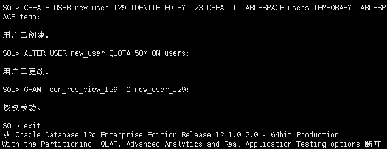
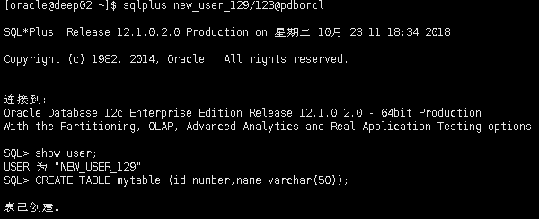
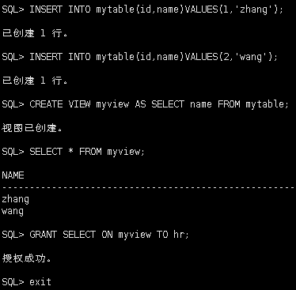
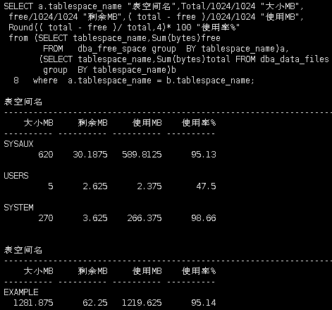
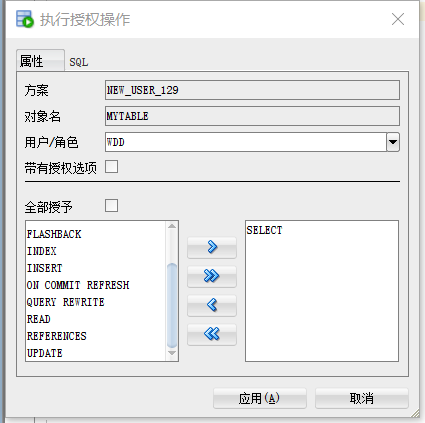
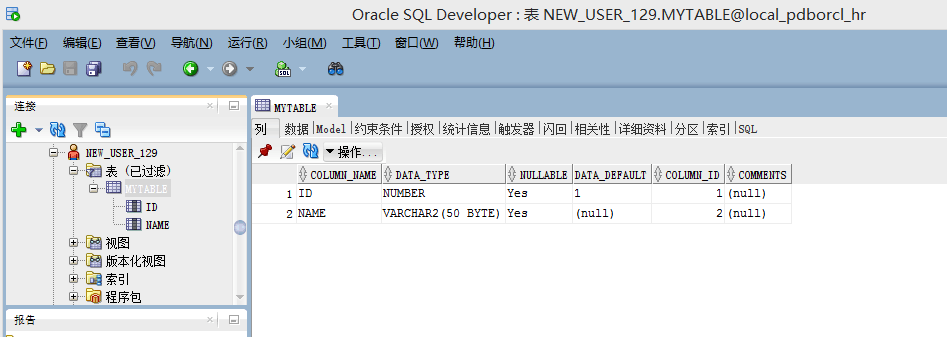
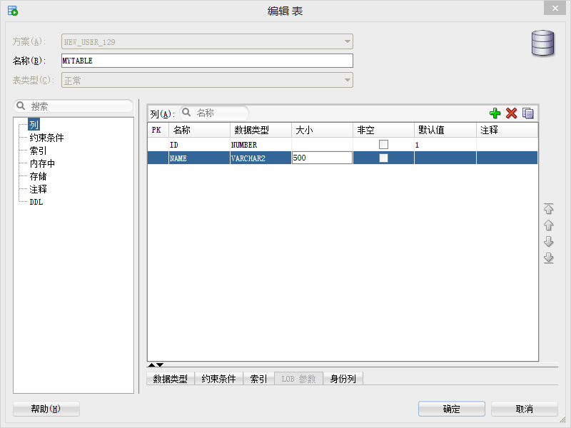
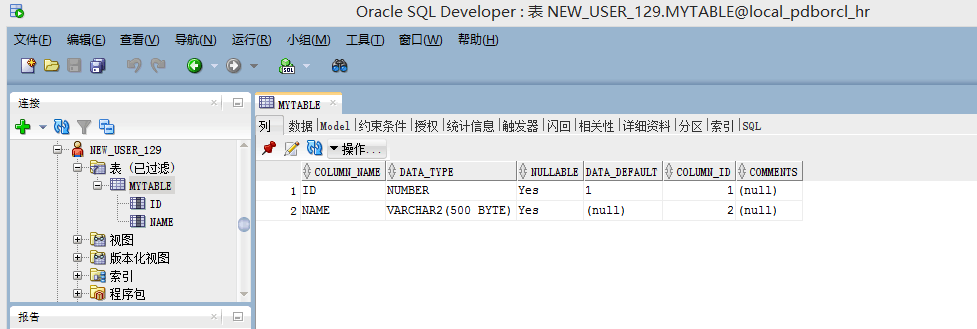

# 实验2：用户管理 - 掌握管理角色、权根、用户的能力，并在用户之间共享对象。

## 实验内容：
Oracle有一个开发者角色resource，可以创建表、过程、触发器等对象，但是不能创建视图。本训练要求：
- 在pdborcl插接式数据中创建一个新的本地角色con_res_view，该角色包含connect和resource角色，同时也包含CREATE VIEW权限，这样任何拥有con_res_view的用户就同时拥有这三种权限。
- 创建角色之后，再创建用户new_user，给用户分配表空间，设置限额为50M，授予con_res_view角色。
- 最后测试：用新用户new_user连接数据库、创建表，插入数据，创建视图，查询表和视图的数据。

## 实验参考步骤

对于以下的对象名称con_res_view，new_user，在实验的时候应该修改为自己的名称。

- 第1步：以system登录到pdborcl，创建角色con_res_view和用户new_user，并授权和分配空间：

> 语句“ALTER USER new_user QUOTA 50M ON users;”是指授权new_user用户访问users表空间，空间限额是50M。

- 第2步：新用户new_user连接到pdborcl，创建表mytable和视图myview，插入数据，最后将myview的SELECT对象权限授予hr用户。

- 第3步：用户hr连接到pdborcl，查询new_user授予它的视图myview

> 测试一下同学用户之间的表的共享，只读共享和读写共享都测试一下。

## 数据库和表空间占用分析

> 当全班同学的实验都做完之后，数据库pdborcl中包含了每个同学的角色和用户。
> 所有同学的用户都使用表空间users存储表的数据。
> 表空间中存储了很多相同名称的表mytable和视图myview，但分别属性于不同的用户，不会引起混淆。
> 随着用户往表中插入数据，表空间的磁盘使用量会增加。

## 查看数据库的使用情况

以下样例查看表空间的数据库文件，以及每个文件的磁盘占用情况。

$ sqlplus system/123@pdborcl

- autoextensible是显示表空间中的数据文件是否自动增加。
- MAX_MB是指数据文件的最大容量。

- sqldeveloper授权对象的操作界面：

- sqldeveloper授权与对象只读权限后的查看界面：

- sqldeveloper授权对象读写权限后的操作界面:

