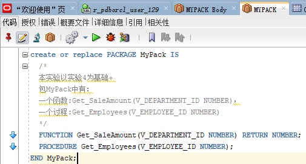
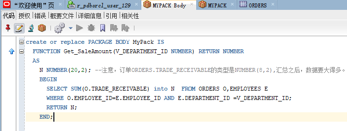
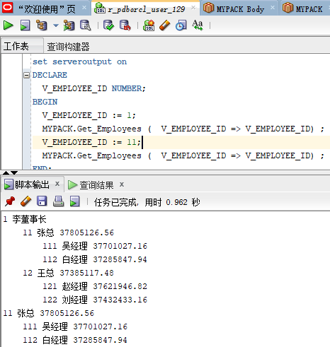
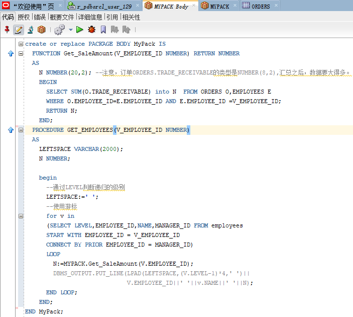

# 实验5：PL/SQL编程

## 实验目的：
    了解PL/SQL语言结构
    了解PL/SQL变量和常量的声明和使用方法
    学习条件语句的使用方法
    学习分支语句的使用方法
    学习循环语句的使用方法
    学习常用的PL/SQL函数
    学习包，过程，函数的用法。

## - 实验场景：
- 假设有一个生产某个产品的单位，单位接受网上订单进行产品的销售。通过实验模拟这个单位的部分信息：员工表，部门表，订单表，订单详单表。
- 本实验以实验四为基础

## 实验内容：
### 1. 创建一个包(Package)，包名是MyPack。
#### 包头结构如下：

### 2. 在MyPack中创建一个函数SaleAmount ，查询部门表，统计每个部门的销售总金额，每个部门的销售额是由该部门的员工(ORDERS.EMPLOYEE_ID)完成的销售额之和。函数SaleAmount要求输入的参数是部门号，输出部门的销售金额。
#### 函数代码如下：

#### 查询结果如下：

### 3. 在MyPack中创建一个过程，在过程中使用游标，递归查询某个员工及其所有下属，子下属员工。过程的输入参数是员工号，输出员工的ID,姓名，销售总金额。信息用dbms_output包中的put或者put_line函数。输出的员工信息用左添加空格的多少表示员工的层次（LEVEL）。比如下面显示5个员工的信息：
#### 函数代码如下：

#### 查询结果如下：

### 4. 由于订单只是按日期分区的，上述统计是全表搜索，因此统计速度会比较慢，如何提高统计的速度呢？

Oracle递归查询的语句格式是：
	
```sql
SELECT LEVEL,EMPLOYEE_ID,NAME,MANAGER_ID FROM employees 
START WITH EMPLOYEE_ID = V_EMPLOYEE_ID 
CONNECT BY PRIOR EMPLOYEE_ID = MANAGER_ID
```
